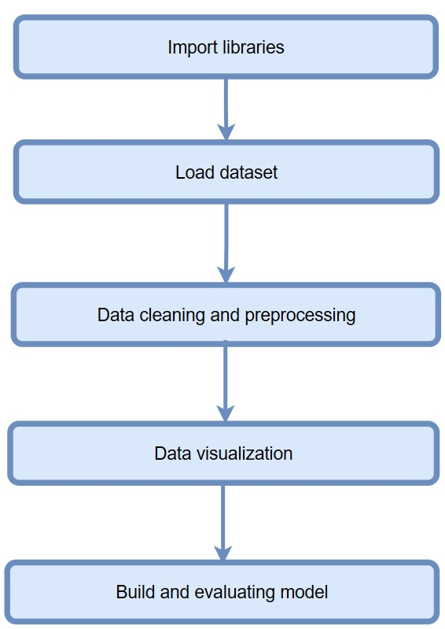
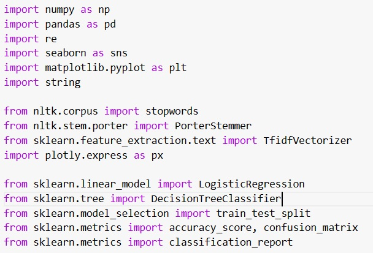
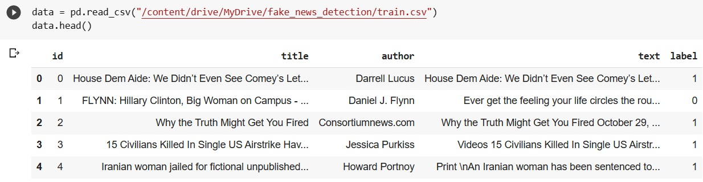
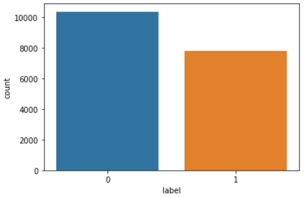
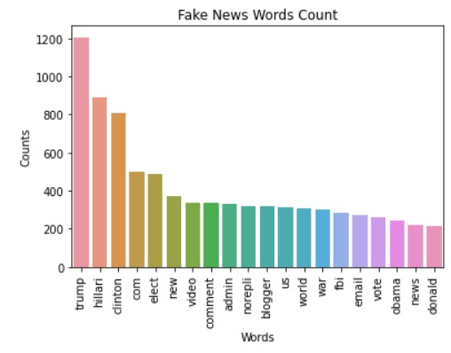
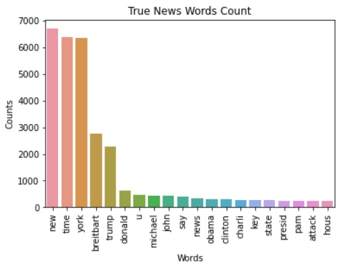
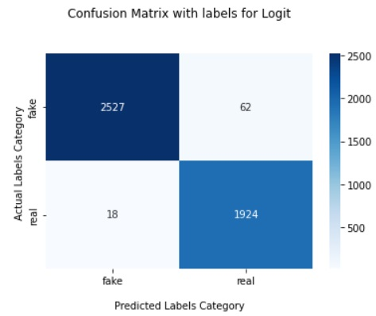
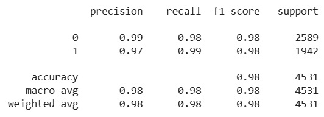
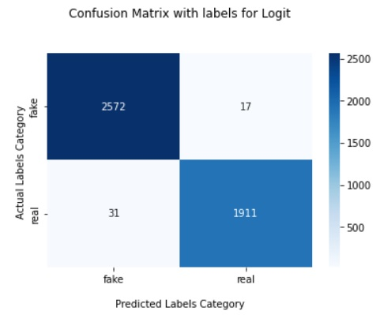
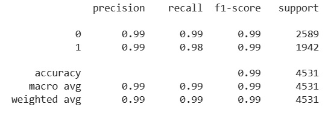

# DS_Fakenews_Detection
## Introduction
This project was created for research and educational purposes.
## Requirement:
* **python**
* **pandas**
* **scikit-learn**
* **nltk**
## Project flow
<p align="center">
  <br/>
</p>

### Import libraries
<p align="center">
  <br/>
</p>

### Import dataset
<p align="center">
  <br/>
</p>

**KAGGLE**:
Download the data set from [kaggle website](https://www.kaggle.com/c/fake-news/#download).
### Data cleaning and preprocessing
* The idea proposed is to use the NLTK library to process and clean the information, and then use the statistical method TF-IDF to transform the set of raw documents into a matrix of TF-IDF features.
```
1. Data cleaning
                │
                ├── Check for missing values  
                │
                ├── check for duplicatevalues
                │
                └── use function to drop missing and duplicate values
                
2. Data preprocessing
                    │
                    ├── Remove numerical values 
                    │
                    ├── Convert text to lower case  
                    │
                    ├── remove stop words
                    │
                    └── tokenize the words
```
### Data visualization
#### 1. Count plot
<p align="center">
  <br/>
</p>

* We can see an equal distribution between fake news and real news, indicating no chance of bias.
#### 2. Specific count of words
 
* We can see word that fake news contain mostly relate to politic. While True news does not contain too many of these word
### Build and evaluate model
#### 1. Logistic regression
 
#### 2. Decision Tree
 
* Although both models used are simple, they produce very good results. This is because the dataset used is also quite simple. Therefore, it can be said that this project is suitable for both educational and research purposes.

## Thank for reading!!!
